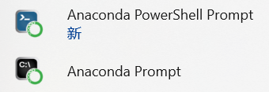

# Task 0: The Very Basics
## 基本概念理解
### 1.偏导数、链式法则、梯度、矩阵等数学概念在机器学习中的作用？
①偏导数：用于衡量单个权重对最终误差的影响，计算损失函数相对于各个权重的导数寻找损失函数的梯度，优化和减小损失函数来调整模型的权重  
②链式法则：计算复合损失函数的偏导数；反向传播算法利用链式法则从输出层开始，逐层向前传播误差并更新权重  
③梯度：用于梯度下降法（沿着梯度的反方向更新权重，使损失函数逐渐减小）  
④矩阵：表示和处理高维数据（图像、文本、音频等）；简化和优化机器学习模型的建立和训练过程，简化模型表达（线性回归、逻辑回归、支持向量机等）；进行模型优化和评估（梯度下降、交叉验证等）  
### 2.什么是“模型”？机器学习中的模型是如何工作的？
①模型：一个包含多个参数的数学函数，反映数据集的数学规律  
②工作方式：推理。推理：通过输入新的测试数据，预测输出结果
### 3.模型没有生物的意识和记忆，它们是如何“学习”的？
学习方法：训练。首先随机生成参数，确定并建立初始基本模型，计算预测值、损失函数的偏导数，用优化算法更新参数值，减小损失函数，多次迭代最终得到最小损失函数和最优函数模型表达式
### 4.什么是监督学习？什么是无监督学习？请分别举一个例子。
①监督学习：通过已标注的训练数据来学习模型的方法 例子：线性回归  
②无监督学习：从未标注的数据中发现模式和结构的方法 例子：K-means  
### 5.AI是什么？深度学习和传统机器学习的区别？
AI：人工智能（Artificial Intelligence），用机器模拟人类的智能，并完成需要人类的智能才可以完成的任务  
区别：  
传统机器学习：①模型的好坏极度依赖于领域专家如何手动设计和提取数据的特征②数据量到一定程度时模型会达到极限③对算力要求相对不高④训练时间较短；  
深度学习:①​极度依赖大量数据，数据越多，性能通常越强②高度依赖GPU，需要强大的并行计算能力③自动学习，省去大量人工操作④部分决策难以解释⑤练成本更高，时间更长
### 6.怎么用矩阵乘法表示神经网络的全连接层前向传播过程？
$$X表示输入，A_i表示隐藏层的中间输出$$  
$$W_i为权重，Y表示输出，σ为激活函数$$
$$X，A_i，W_i，Y都是矩阵$$
$$第一层输出A_1=σ(W_0X)$$
$$第二层输出A_2=σ(W_1A_1)$$
$$第三层输出A_3=σ(W_2A_2)$$
$$......$$
$$输出Y=σ(W_nA_n)$$
## 编程与开发环境
### Python 与 C 语言的区别？
①C语言是一种编译型语言，依赖编译器，运行时先将C语言代码翻译成二进制机器指令，即利用C编译程序翻译成.obj二进制文件，再通过链接程序把.obj文件转化成.exe可执行文件，执行效率更高，运行速度会更快。  
②Python是一种解释型语言，依赖解释器，解释器直接利用用户的输入逐行执行源程序的指定操作，效率会更低，运行速度较慢。
### 如何用命令行运行 python 程序？
①将python添加到环境变量  
②打开命令行  
③输入```cd+路径导到```.py文件目录  
④输入命令```python 文件名.py```
### 为什么需要 python 虚拟环境？在命令行中如何在不使用 conda 指令的情况下使用指定虚拟环境？
①虚拟环境能通过为不同的项目创建独立的 Python 环境解决项目之间的依赖冲突问题  
②修改环境变量或者直接打开虚拟环境的python解释器


