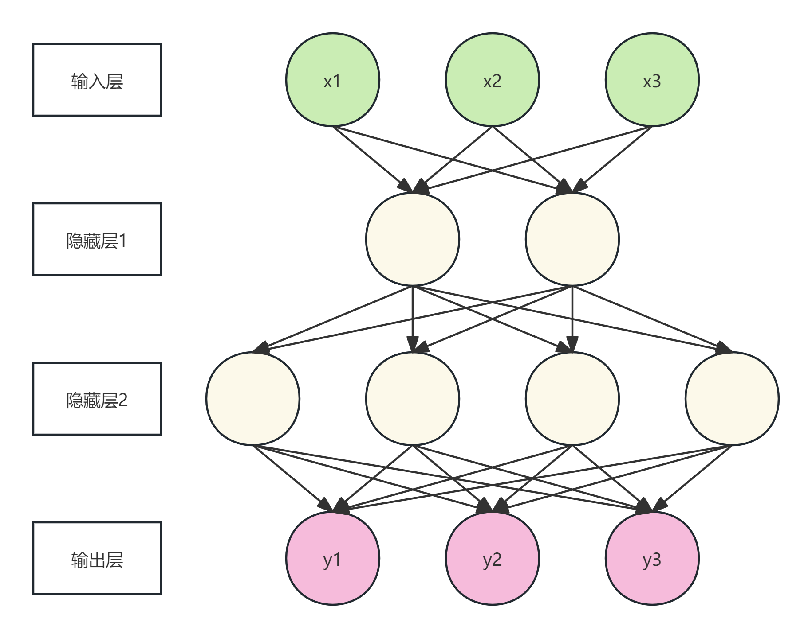

## 概念理解
### 什么是多层感知机（MLP）？其结构是怎样的？
每一层的神经元与下一层的所有神经元相连的神经网络架构；其结构由输入层、一个或多个隐藏层和输出层组成，各层间神经元全连接。

### 数据在神经网络中扮演哪些角色？（数据集的 split 和处理）
①模型知识的来源，训练集是模型构建的基础  
②指导训练过程，验证集在训练过程中评估模型表现，用于调整超参数，监控是否出现过拟合  
③评估模型好坏的标准，测试集负责最终评估模型的泛化能力  

### 噪声是什么？特征是什么？标签是什么？
①噪声是指数据中存在的随机误差或无关信息。  
②特征是描述一个数据样本的属性或观察指标，是模型的输入和模型据以做出预测的依据。  
③标签是模型预测的目标值或正确答案，是模型的输出所应该逼近的目标。  

### Batch size 是什么？为什么堆叠成 Batch 可以提高运算速度？
①Batch Size批量大小，指在训练神经网络时，一次性输入模型进行前向传播和反向传播的样本数量。  
②可以使用GPU在硬件层面的并行计算，将向量运算转变为矩阵运算，提升运算效率；一次性将一批数据从内存加载到计算核心，比多次加载小块数据的效率高，减少了内存访问的开销；现代深度学习框架（如PyTorch、TensorFlow）的底层库都对批处理矩阵运算做了极致的优化，且只有在使用Batch时才能充分发挥作用。

### 神经元是什么？
神经元是神经网络的基本计算单元，接收来自其他神经元或多个外部数据源的输入信号。每个输入都有一个权重，表示这个输入的重要程度。神经元将输入x加权求和，再加上偏置z=w⋅x+b，再将z通过激活函数，得到输出y=f(z)

### 什么是激活函数？常见的激活函数有哪些？什么叫“非线性表达能力”？
①激活函数是神经网络中每个神经元在完成输入加权求和后，施加的一个非线性数学函数。若不添加激活函数，则整个网络都等价于一个单层线性模型。  
②Sigmoid函数：  
$$f(x) = \frac{1}{1 + e^{-x}}$$
输出范围：(0, 1)  
特点：将输入压缩到0-1之间，适合表示概率  
②Tanh函数：  
$$f(x) = \frac{e^{x} - e^{-x}}{e^{x} + e^{-x}}$$
输出范围：(-1, 1)    
特点：输出是零中心的，比Sigmoid更好  
③ReLU函数：  
$$f(x) = max(0, x)$$  
输出范围：[0, +∞)    
优点：    
计算非常简单高效    
缓解了梯度消失问题（在正区梯度为1）  
在实践中表现优异  
缺点：负数输入永远输出0  
④Leaky ReLU函数：
$$f(x) = max(αx, x)，α = 0.01$$
⑤Softmax函数：
$$f(x_i) = \frac{e^{x_i}}{Σe^{x_i}}$$
功能：将多个神经元的输出转换为概率分布  
特点：所有输出之和为1

### 什么是计算图？它和数据结构/离散数学中学的图有什么区别？怎么构建计算图？
①计算图是一种用于描述数学计算的有向图，其中节点代表操作（如加法、乘法）或变量（输入、参数），边代表数据流或依赖  
②计算图的节点代表数学运算或数据，边代表数据流或计算依赖，结构通常是有向无环图，可以动态构建，用于计算求值和自动求导，节点明确操作类型；  
数据结构/离散数学的图的节点可以是任意实体，边表示各种关系，结构可以是有向或无向且可以有环，通常是静态结构，用于路径查找、连通性分析、求最优解等，节点通常是同质的

### 怎么计算MLP的参数量？什么是超参数？MLP有哪些超参数？
①统计所有权重和偏置的数量  
单层参数量 = (前一层神经元数 × 当前层神经元数) + 当前层神经元数  
总参数量 = 所有单层参数量之和  
②超参数是在开始训练模型之前需要手动设定的参数  
③隐藏层数量；每层神经元数量；激活函数类型；学习率；Batch size批量大小；迭代次数；优化器；正则化超参数  

### 什么是隐藏层（hidden layers）？它为什么叫这个名字？
①隐藏层是位于神经网络输入层和输出层之间的中间计算层，在内部进行复杂的特征变换和学习。  
②隐藏层不直接与外部世界交互，位于输入层和输出层之间，其输入和输出都是内部表示，对我们来说是"不可见"的；其特征表示对人类来说往往是难以直观理解的，属于“黑箱”过程

### 什么是损失函数？什么任务用什么损失函数？
①损失函数（代价函数）是衡量模型预测结果与真实值之间差异的函数，用于评估模型的好坏。  
②回归任务：均方误差

### 前向传播是什么？梯度是什么？学习率是什么？反向传播是什么？有哪些常见的优化器？  
①前向传播是数据从输入层流向输出层的过程，目的是计算模型的预测结果。  
②梯度是一个向量，每一个元素是函数对一个特征的偏导数，指向函数值增长最快的方向，其大小表示增长速率。  
③学习率控制每次参数更新时的步长大小，新参数 = 旧参数 - 学习率 × 梯度  
④反向传播是利用链式法则从输出层到输入层计算梯度的算法。  
⑤优化器：  
梯度下降法：批量梯度下降，随机梯度下降，小批量梯度下降；  
动量法：经典动量，Nesterov动量；  
自适应学习率:AdaGrad，RMSProp，Adam；  
二阶方法:L-BFGS  

### 归一化是什么？正则化是什么？
①对输入数据或中间层输出的缩放处理，目的是使数据处于相似的数值范围，从而加速训练并提高稳定性。  
②正则化是通过对模型添加约束来防止过拟合的技术，目的是提高模型的泛化能力。  

### 什么是欠拟合？什么是过拟合？
①具有高偏差，在训练集和测试集上表现都不好。  
②具有高方差，在训练集上表现良好，在测试集上表现不好。

## 代码实践

### 借助框架（PyTorch）实现一个简单的神经网络（输入层-数层隐藏层-输出层）
画出你神经网络的架构


### 使用简单的数据集 dataset（如 scikit-learn 的 make_moons 或 make_circles）进行训练（二分类问题）
#### 尝试调整 noise 的大小，对比模型的效果。
noise = 0时
```
轮次 [100/1000], 损失: 0.3061, 训练准确率: 0.8440, 测试准确率: 0.8760
轮次 [200/1000], 损失: 0.2363, 训练准确率: 0.8853, 测试准确率: 0.9200
轮次 [300/1000], 损失: 0.2156, 训练准确率: 0.8987, 测试准确率: 0.9160
轮次 [400/1000], 损失: 0.1944, 训练准确率: 0.9093, 测试准确率: 0.9240
轮次 [500/1000], 损失: 0.1628, 训练准确率: 0.9267, 测试准确率: 0.9440
轮次 [600/1000], 损失: 0.1186, 训练准确率: 0.9507, 测试准确率: 0.9760
轮次 [700/1000], 损失: 0.0745, 训练准确率: 0.9840, 测试准确率: 0.9840
轮次 [800/1000], 损失: 0.0453, 训练准确率: 1.0000, 测试准确率: 1.0000
轮次 [900/1000], 损失: 0.0293, 训练准确率: 1.0000, 测试准确率: 1.0000
轮次 [1000/1000], 损失: 0.0204, 训练准确率: 1.0000, 测试准确率: 1.0000
最终测试准确率: 1.0000
```
noise = 0.1时
```
轮次 [100/1000], 损失: 0.2983, 训练准确率: 0.8707, 测试准确率: 0.8920
轮次 [200/1000], 损失: 0.2470, 训练准确率: 0.8813, 测试准确率: 0.9120
轮次 [300/1000], 损失: 0.2252, 训练准确率: 0.8933, 测试准确率: 0.9320
轮次 [400/1000], 损失: 0.1947, 训练准确率: 0.9120, 测试准确率: 0.9400
轮次 [500/1000], 损失: 0.1573, 训练准确率: 0.9320, 测试准确率: 0.9480
轮次 [600/1000], 损失: 0.1099, 训练准确率: 0.9613, 测试准确率: 0.9840
轮次 [700/1000], 损失: 0.0697, 训练准确率: 0.9853, 测试准确率: 0.9920
轮次 [800/1000], 损失: 0.0465, 训练准确率: 0.9893, 测试准确率: 0.9960
轮次 [900/1000], 损失: 0.0335, 训练准确率: 0.9933, 测试准确率: 1.0000
轮次 [1000/1000], 损失: 0.0256, 训练准确率: 0.9960, 测试准确率: 1.0000
最终测试准确率: 1.0000
```
noise = 0.2时
```
轮次 [100/1000], 损失: 0.4445, 训练准确率: 0.8173, 测试准确率: 0.8160
轮次 [200/1000], 损失: 0.3293, 训练准确率: 0.8640, 测试准确率: 0.8680
轮次 [300/1000], 损失: 0.2870, 训练准确率: 0.8787, 测试准确率: 0.9000
轮次 [400/1000], 损失: 0.2677, 训练准确率: 0.8853, 测试准确率: 0.9120
轮次 [500/1000], 损失: 0.2501, 训练准确率: 0.8907, 测试准确率: 0.9200
轮次 [600/1000], 损失: 0.2260, 训练准确率: 0.9040, 测试准确率: 0.9240
轮次 [700/1000], 损失: 0.1946, 训练准确率: 0.9213, 测试准确率: 0.9320
轮次 [800/1000], 损失: 0.1617, 训练准确率: 0.9360, 测试准确率: 0.9520
轮次 [900/1000], 损失: 0.1349, 训练准确率: 0.9547, 测试准确率: 0.9680
轮次 [1000/1000], 损失: 0.1169, 训练准确率: 0.9613, 测试准确率: 0.9760
最终测试准确率: 0.9760
```
#### 用 matplotlib 将数据集可视化，想想怎么从数学层面表达你选用的数据集？


#### 实现参数初始化、前向传播、损失计算、反向传播和参数更新
模型参数初始化
```
def __init__(self):
        super(SimpleNN, self).__init__()
        self.layer1 = nn.Linear(2, 10)
        self.layer2 = nn.Linear(10, 10)
        self.layer3 = nn.Linear(10, 1)
        self.relu = nn.ReLU()
        self.sigmoid = nn.Sigmoid()
```

前向传播
```
def forward(self, x):
        x = self.layer1(x)
        x = self.relu(x)
        x = self.layer2(x)
        x = self.relu(x)
        x = self.layer3(x)
        x = self.sigmoid(x)
        
        return x
```

损失函数
```
criterion = nn.BCELoss()

loss = criterion(outputs, y_train)

test_loss = criterion(test_outputs, y_test)
```


反向传播
```
loss.backward()
```

参数更新
```
# 优化器
optimizer = optim.SGD(model.parameters(), lr=0.1)

optimizer.step()
```

#### 可视化输出训练损失下降曲线与分类准确率


#### 模型的输出表示的应该是这个样本属于每个类别的概率值，所有类别（这里是 2 个）的概率值加起来为 1（你是通过什么手段保证这一点的？如果有更多类呢）。训练好模型后，用 matplotlib 把空间中的每个点推理结果可视化（热力图）。
Sigmoid函数可以将中间输出压缩到(0,1)区间,得到模型的输出。模型输出表示样本属于类别1的概率值，而类别0的概率就是1减去这个值。如果有多个类，用Sigmoid函数也可以将所有类的中间输出归一化为(0,1)区间内的概率值，加起来为1.
$$
\text{softmax}(z_i) = \frac{e^{z_i}}{\sum_{j=1}^{K} e^{z_j}} \quad \text{对于 } i = 1, 2, \dots, K
$$


