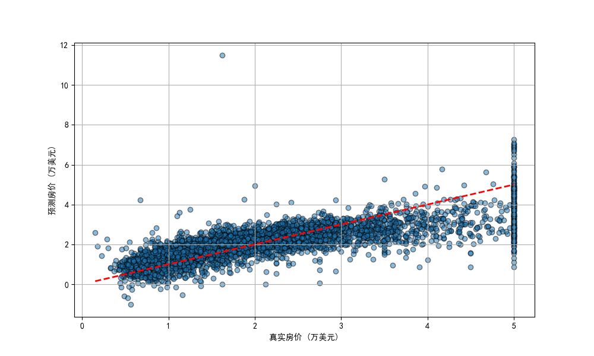

## 概念
### 在预测房价的模型中，模型的输出是什么？它是连续的还是离散的？  
①房价的数值  
②连续的  

### 什么是“线性回归”？试着用一句话描述它是如何工作的。解释你在高中学习的“最小二乘法”的原理。  
①寻找一条最佳拟合直线（或平面），使得所有数据点到这条直线的垂直距离的平方和最小，从而用一个或多个输入特征来预测一个连续的输出值。  
②用求导等方式使预测值的残差平方和最小

### 评价一个回归模型的好坏，常用的一个指标有什么？  
损失函数的值

## 代码实操
本题使用 Python 和 scikit-learn 库。

### 加载 scikit-learn 自带的加州房价数据集 15。查看数据的特征形状和目标值形状。
```
california = fetch_california_housing()
X = california.data
y = california.target 

print("特征形状:", X.shape)
print("目标值形状:", y.shape) 
```
```
特征形状: (20640, 8)
目标值形状: (20640,)
```

### 使用线性回归模型训练数据，并将数据集拆分为训练集和测试集。
```
X_train, X_test, y_train, y_test = train_test_split(X, y, test_size=0.2, random_state=42)

model = LinearRegression()
model.fit(X_train, y_train)

y_pred = model.predict(X_test)
```

### 在测试集上进行预测，并计算模型的均方误差（MSE）和决定系数（R²）。
```
mse = mean_squared_error(y_test, y_pred)
r2 = r2_score(y_test, y_pred)
print(f"\n均方误差(MSE): {mse:.4f}")
print(f"决定系数(R²): {r2:.4f}")
```
```
均方误差(MSE): 0.5559
决定系数(R²): 0.5758
```


### 尝试绘制一个散点图，x轴是真实房价，y轴是模型预测的房价。如果预测完美，所有点会形成一条什么样的线？
```
plt.rcParams['font.sans-serif'] = ['SimHei']
plt.figure(figsize=(10, 6))
plt.scatter(y_test, y_pred, alpha=0.5, edgecolors='k')
plt.plot([y.min(), y.max()], [y.min(), y.max()], 'r--', lw=2) 

plt.xlabel('真实房价 (万美元)')
plt.ylabel('预测房价 (万美元)')
plt.grid(True)
plt.show()
```

如果预测完美，所有点会形成一条斜率为​1的直线

## 概念

### 分类任务的输出是什么？它和回归任务的输出有什么本质不同？  
①离散的概率值  
②分类任务的输出用于判断质，回归任务的输出是连续的值，用于预测量的大小  

### 什么是“二分类”问题？什么是“多分类”问题？请分别举一个例子。怎么实现二分类和多分类？  
①二分类：指将样本分为两个互斥类别的分类任务。  
②多分类：指将样本分为三个或更多互斥类别的分类任务。  
③  
垃圾邮件检测（二分类）：首先收集大量邮件，人工标记为"垃圾邮件"或"正常邮件"，然后提取邮件特征（如关键词频率、发件人信誉、链接数量等），再构建逻辑回归模型（输入层是1个神经元，使用Sigmoid激活函数）得到是"垃圾邮件"的概率  
手写数字识别（多分类）：首先收集手写数字图片并标记对应数字，然后将图片转化为特征向量，再构建神经网络模型（输入层是10个神经元，使用Softmax激活函数）得到10个概率值，选择最高的概率作为预测结果  

### 评价分类模型指标有哪些？  
①二分类：准确率、召回率、F1  
②多分类：Micro F1、Macro F1

## 代码实操
### Iris
同样使用 Python 和 scikit-learn。

加载 scikit-learn 自带的鸢尾花（Iris）数据集。
#### 这是一个什么类型的分类问题（二分类/多分类）？数据集里有多少个类别？  
多分类问题；有三个类别
```
num_samples = 100
iris = load_iris()

# 导入数据集
X = iris.data
y = iris.target

# # 将numpy矩阵转化为torch矩阵
X = torch.tensor(X, dtype = torch.float)
y = torch.tensor(y, dtype = torch.long)
```
```
特征矩阵的形状:
torch.Size([150, 4])

输出矩阵的形状:
torch.Size([150])

输出的值:
tensor([0, 0, 0, 0, 0, 0, 0, 0, 0, 0, 0, 0, 0, 0, 0, 0, 0, 0, 0, 0, 0, 0, 0, 0,0, 0, 0, 0, 0, 0, 0, 0, 0, 0, 0, 0, 0, 0, 0, 0, 0, 0, 0, 0, 0, 0, 0, 0,0, 0, 1, 1, 1, 1, 1, 1, 1, 1, 1, 1, 1, 1, 1, 1, 1, 1, 1, 1, 1, 1, 1, 1,1, 1, 1, 1, 1, 1, 1, 1, 1, 1, 1, 1, 1, 1, 1, 1, 1, 1, 1, 1, 1, 1, 1, 1,1, 1, 1, 1, 2, 2, 2, 2, 2, 2, 2, 2, 2, 2, 2, 2, 2, 2, 2, 2, 2, 2, 2, 2,2, 2, 2, 2, 2, 2, 2, 2, 2, 2, 2, 2, 2, 2, 2, 2, 2, 2, 2, 2, 2, 2, 2, 2,2, 2, 2, 2, 2, 2])
```

#### 使用逻辑回归（Logistic Regression）模型训练数据，并划分训练集和测试集。
```
# 划分训练集、测试集
X_train, X_test, y_train, y_test = train_test_split(X, y, test_size = 0.25, random_state = 42)

class BC(nn.Module):
    def __init__(self, num_inputs, num_outputs, num_hiddens):
        super().__init__()

        self.layer1 = nn.Linear(num_inputs, num_hiddens)
        self.layer2 = nn.Linear(num_hiddens, num_hiddens)
        self.layer3 = nn.Linear(num_hiddens, num_hiddens)
        self.layer4 = nn.Linear(num_hiddens, num_outputs)

    def relu(self, x):
        M = torch.zeros_like(x)
        return torch.max(x, M)
  
    def forward(self, x):
        z1 = self.relu(self.layer1(x))
        z2 = self.relu(self.layer2(z1))
        z3 = self.relu(self.layer3(z2))
        y = self.layer4(z3)
        return y

model = BC(4, 3, 5)

# # 定义损失函数
loss_f = nn.CrossEntropyLoss()
optimizer = torch.optim.SGD(params = model.parameters(), lr = 0.1)

# 训练循环
train_losses = []
test_losses = []

epochs = 1000
for epoch in range(epochs):
    # 训练阶段
    model.train()
    optimizer.zero_grad()
    
    # 前向传播
    outputs = model(X_train)
    loss = loss_f(outputs, y_train)
    
    # 反向传播和优化
    loss.backward()
    optimizer.step()
    
    # 记录训练损失
    train_losses.append(loss.item())
    
    # 测试阶段
    model.eval()
    with torch.no_grad():
        train_preds = torch.argmax(model(X_train), dim=1)
        train_acc = (train_preds == y_train).float().mean()
        
        # 计算测试集准确率
        test_preds = torch.argmax(model(X_test), dim=1)
        test_acc = (test_preds == y_test).float().mean()


```

#### 在测试集上进行预测，并计算模型的准确率（Accuracy）。
```
print(f'训练准确度: {train_acc.item()*100:.2f}%')
print(f'测试准确度: {test_acc.item()*100:.2f}%')
```
```
训练准确度: 97.32%
测试准确度: 100.00%
```

#### 打印模型的混淆矩阵（Confusion Matrix），并尝试说明矩阵中数字的含义。
```
# 转换为numpy数组
y_true = y_test.numpy()
y_pred = test_preds.numpy()

# 计算混淆矩阵
cm = confusion_matrix(y_true, y_pred)

# 打印混淆矩阵
print("\n混淆矩阵:")
print(cm)
```
```
混淆矩阵:
[[15  0  0]
 [ 0 11  0]
 [ 0  0 12]]
 ```
 对角线元素为正确分类，第i列为类别i，表明在38个测试样例中，有15个被正确分类为类别1,11个被正确分类为类别2,12个被正确分类为类别3.

### Titanic
背景介绍
泰坦尼克号生存预测数据集是一个经典的二分类问题数据集，它包含了泰坦尼克号乘客的各种属性，如舱位等级、年龄、性别、船票价格、登船港口、是否携带亲属等，以及乘客是否在灾难中幸存。本题要求使用PyTorch框架来构建和训练一个神经网络模型，以预测乘客是否生还。

#### 数据分析：  
PassengerId => 乘客ID  
Pclass => 乘客等级(1/2/3等舱位)  
Name => 乘客姓名  
Sex => 性别  
Age => 年龄  
SibSp => 堂兄弟/妹个数  
Parch => 父母与小孩个数  
Ticket => 船票信息  
Fare => 票价  
Cabin => 客舱  
Embarked => 登船港口
```
     PassengerId  Survived  Pclass                                               Name     Sex   Age  SibSp  Parch            Ticket     Fare Cabin Embarked
0              1         0       3                            Braund, Mr. Owen Harris    male  22.0      1      0         A/5 21171   7.2500   NaN        S
1              2         1       1  Cumings, Mrs. John Bradley (Florence Briggs Th...  female  38.0      1      0          PC 17599  71.2833   C85        C
2              3         1       3                             Heikkinen, Miss. Laina  female  26.0      0      0  STON/O2. 3101282   7.9250   NaN        S
3              4         1       1       Futrelle, Mrs. Jacques Heath (Lily May Peel)  female  35.0      1      0            113803  53.1000  C123        S
4              5         0       3                           Allen, Mr. William Henry    male  35.0      0      0            373450   8.0500   NaN        S
..           ...       ...     ...                                                ...     ...   ...    ...    ...               ...      ...   ...      ...
886          887         0       2                              Montvila, Rev. Juozas    male  27.0      0      0            211536  13.0000   NaN        S
887          888         1       1                       Graham, Miss. Margaret Edith  female  19.0      0      0            112053  30.0000   B42        S
888          889         0       3           Johnston, Miss. Catherine Helen "Carrie"  female   NaN      1      2        W./C. 6607  23.4500   NaN        S
889          890         1       1                              Behr, Mr. Karl Howell    male  26.0      0      0            111369  30.0000  C148        C
890          891         0       3                                Dooley, Mr. Patrick    male  32.0      0      0            370376   7.7500   NaN        Q
```
```
Data columns (total 12 columns):
 #   Column       Non-Null Count  Dtype
---  ------       --------------  -----
 0   PassengerId  891 non-null    int64
 1   Survived     891 non-null    int64
 2   Pclass       891 non-null    int64
 3   Name         891 non-null    object
 4   Sex          891 non-null    object
 5   Age          714 non-null    float64
 6   SibSp        891 non-null    int64
 7   Parch        891 non-null    int64
 8   Ticket       891 non-null    object
 9   Fare         891 non-null    float64
 10  Cabin        204 non-null    object
 11  Embarked     889 non-null    object
 ```
 ```
        PassengerId    Survived      Pclass         Age       SibSp       Parch        Fare
count   891.000000  891.000000  891.000000  714.000000  891.000000  891.000000  891.000000
mean    446.000000    0.383838    2.308642   29.699118    0.523008    0.381594   32.204208
std     257.353842    0.486592    0.836071   14.526497    1.102743    0.806057   49.693429
min       1.000000    0.000000    1.000000    0.420000    0.000000    0.000000    0.000000
25%     223.500000    0.000000    2.000000   20.125000    0.000000    0.000000    7.910400
50%     446.000000    0.000000    3.000000   28.000000    0.000000    0.000000   14.454200
75%     668.500000    1.000000    3.000000   38.000000    1.000000    0.000000   31.000000
max     891.000000    1.000000    3.000000   80.000000    8.000000    6.000000  512.329200
```

#### 题目要求
#### 使用PyTorch框架构建一个神经网络模型
```
class TitanicModel(nn.Module):
    def __init__(self, input_size):
        super(TitanicModel, self).__init__()
        self.fc1 = nn.Linear(input_size, 64)
        self.fc2 = nn.Linear(64, 32)
        self.fc3 = nn.Linear(32, 1)
        self.relu = nn.ReLU()
        self.sigmoid = nn.Sigmoid()
        self.dropout = nn.Dropout(0.2)
        
    def forward(self, x):
        x = self.relu(self.fc1(x))
        x = self.dropout(x)
        x = self.relu(self.fc2(x))
        x = self.dropout(x)
        x = self.sigmoid(self.fc3(x))
        return x
```

#### 对数据进行预处理，包括归一化、处理缺失值等。
```
# 训练集预处理
train = train.dropna(subset=['Embarked'])
train['Age'] = train.groupby('Sex')['Age'].transform(lambda x: x.fillna(x.mode()[0]))
Sex_dummies = pd.get_dummies(train['Sex'], prefix= 'Sex', dtype=int)
Embarked_dummies = pd.get_dummies(train['Embarked'], prefix= 'Embarked', dtype=int)
train = train.drop('PassengerId', axis=1)
train = train.drop('Name', axis=1)
train = train.drop('Cabin', axis=1)
train = train.drop('Ticket', axis=1)
train = train.drop('Sex', axis=1)
train = train.drop('Embarked', axis=1)
train = pd.concat([train, Sex_dummies, Embarked_dummies], axis=1)
print(train.info())

scaler = preprocessing.StandardScaler()
train['Age'] = scaler.fit_transform(train[['Age']])
train['Fare'] = scaler.fit_transform(train[['Fare']])
print(train)

# 测试集预处理
test = pd.read_csv('test.csv')
test = test.dropna(subset=['Fare'])
test1 = test.dropna(subset=['Fare'])
test['Age'] = test.groupby('Sex')['Age'].transform(lambda x: x.fillna(x.mode()[0]))
Sex_dummies = pd.get_dummies(test['Sex'], prefix= 'Sex', dtype=int)
Embarked_dummies = pd.get_dummies(test['Embarked'], prefix= 'Embarked', dtype=int)
test = test.drop('PassengerId', axis=1)
test = test.drop('Name', axis=1)
test = test.drop('Cabin', axis=1)
test = test.drop('Ticket', axis=1)
test = test.drop('Sex', axis=1)
test = test.drop('Embarked', axis=1)
test = pd.concat([test, Sex_dummies, Embarked_dummies], axis=1)

scaler = preprocessing.StandardScaler()
test['Age'] = scaler.fit_transform(test[['Age']])
test['Fare'] = scaler.fit_transform(test[['Fare']])
```

#### 训练模型与并且进行分类预测

#### 评估模型性能
```
模型评估结果:
准确率: 0.8427
精确率: 0.9107
召回率: 0.6892
F1分数: 0.7846
混淆矩阵:
[[99  5]
 [23 51]]
```

